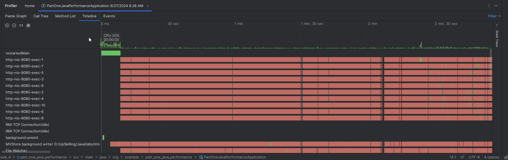

### Java performance
This section deals with optimizing already existing application to indicate all 
performance bottlenecks. The screenshots below illustrate when was achieved

### Memory management
Visualvm was used to analyse the amount of memory, heap dump and cpu 
resources used by the application. I manually perform garbage collection and saw a drastic decrease is memory

### Testing
I did a ui testing using selenium and a sample ecormerce application. I browse products and product details with selenium

### Jenkins
I deployed a basic spring boot application with jenkins